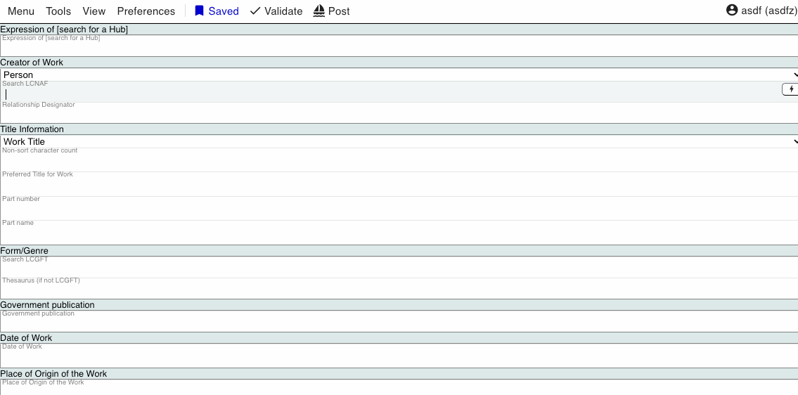

### Field Types

There are three different types of fields in Marva. A field is simply a place you enter information. Since Marva is a Linked Data editor behind the scenes it is storing the information you enter in various data structures, these different types of fields reflect that process.

---

#### Literal

A literal is a string value which is just a series of characters or text. In RDF Linked Data a value can be a literal or a resource, basically a string value or a link to an entity. Literals are just text and support the full range of Unicode values. An example of a literal field is the bf:mainTitle property:

When you are entering data into a literal field it behaves like a text editor. You can copy/paste/etc.

The action button (lighting bolt) button (see the action button feature for more info) in the literal field will have couple unique actions available:

Additional Literal - Adds another literal input field, we use this if a resource needs to have a transliterated title for example. Clicking it will create another field in the same title component :

See the Literal Language feature for more information

Set Language - Sets the language of the literal value, see the Literal Language feature documentation for more info.

Transliterate buttons - If you use Scriptshifter and have configured your language preferences they will appear here for quick access, look at the Scriptshifter feature documentation for more info.

---

#### Simple Lookups

In Marva we call fields that can link to a limited vocabulary a Simple Lookup. As opposed to a Literal value these values are simply pointers, what we call URIs to existing entities, usually an existing vocabulary. For example the bf:intendedAudience property uses values from the Intended Audience vocabulary list, which is represented as Linked Data at https://id.loc.gov/vocabulary/maudience.html The input to the field looks like a Literal value field:

When we start typing anything it will search the Labels of the vocabulary and offer us a pick list of possible values based on what we typed, for example if I enter the letter "a" it will show all the options that match that search in the label or code of the list:

At this point we can click with the mouse one of the options or we can use the [Up] or [Down] arrow keys on the keyboard to navigate the list and [Enter] key to select the hi-lighted option.

Before you type anything if you want to see all options you can press the [Spacebar] key and it will show the list of all possible options:

Sometimes the vocabulary lists will have variant labels that you may want to refer to them but do not show up in the list under that variant label. For example Arist relator term has Graphic technician https://id.loc.gov/vocabulary/relators/art.html as a variant label. If you entered "graphic" the field will see that there is no match for that search value in the authorized label or codes and search the variant labels:

When you click or use the keyboard to select and hit [Enter] the term will be selected:

Some Simple Lookup fields can contain multiple values, for example the relator field:

When the Simple Lookup is the only field in the component, like Intended Audience, the system will prevent you from entering multiple values, this is due to the structure of the data being created. If you really needed to add multiple values for a field like Intended Audience you can simply add another component from the Action Button and set another value.

You can remove a value from the field by click the little [x] in the label. 

You can also remove it by being in the field and hitting the [Backspace] key twice quickly in a row, in this example the values are being removed with the backspace key, pressing the key a total of 4 times in a row:

If you are in Simple Lookup field and the vocabulary list is open you can hit the [ESC] escape key to close it, it will automatically close though when you leave the field as well.

Keyboard Shortcut review: 

- View all vocabulary options without searching

or - Navigate the list

 - While navigating the list enter key will select the highlighted option

 - Hitting backspace twice in a row in a Simple Lookup field will delete  the value

- Closes the vocabulary list manually

---

#### Complex Lookups

A Complex Lookup is similar to a Simple Lookup except that instead of reflecting a limited vocabulary list you are searching many millions of possible entities to build a link. Types of entities that use this field would include things like NAF name authorities, LCSH subject headings, or Hubs for example.

For all complex lookups except Subject headings (refer to the subject heading field documentation) when you start entering a value into the complex heading field you will see a pop-up window, sometimes called a "modal" window, for example here I'm typing into the creator of work primary contributor field:

As you type or copy and paste into this field it will kick off a search into the authority the field belongs to, in this case it is searching the name authorities. The purpose of this pop-up is for you to reconcile the string you type into a linked entity. 

The buttons at the top of the pop-up allow you to filter the search result more narrowly, since you are keyword searching the entire authority if you knew you were looking for a personal name you could limit the results to that type of authority:

When you click a name in the list or use the [Up] and [Down] keyboard arrows it will navigate the authorities in the list and display on the right hand side information about that authority:

This will show you information about that authority, you can also click the "view on id.loc.gov" to view the full authority record.

When you locate the authority you want to use you can click the "Add" button on the right or use the keyboard shortcut [Shift] + [Enter] key. You can close the window without changing anything by clicking Cancel or using the [Escape] key.

When added the field will update with the linked entity:

Whenever you are searching an authority there will be the option to add a value as a literal:

This option allows you to add a literal value (string or text value) without a link to the entity in the data. This is usually not a good practice as we want to always use links instead of just text. But there maybe some situations where you would need to add the authority as a literal, most likely around a proposed heading not being available yet for example. 

Keyboard Shortcut review: 

or - Navigate the list

 - While in the pop-up, adds the selected heading to the field

- Closes the pop-up window