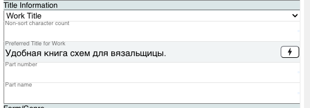
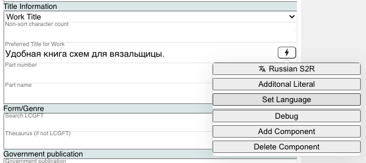
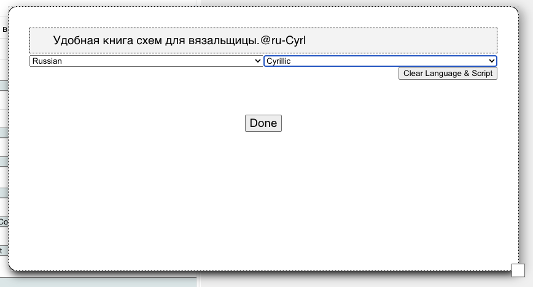
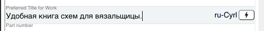
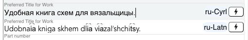

### Literal Language and Scripts

When working with non-english literal values in Marva it is desirable to mark any literal values that are not in English with their language. In the raw RDF the value of the string then is stored like this:

```
"Test String"@xx
```

Where "xx" is the ISO code (ISO 639) for the language. If the string is also in a non-latin script that should be saved as well. In raw RDF that would like like this:

```
"Test String"@xx-zzzz
```

Where zzzz is the ISO code (ISO 15924) for the script. This metadata about the literal can be serialized in a number of ways, above is one example, in XML it is serialized using a xml:lang attribute. The main idea is that we want to save that information when dealing with non English literals.


In the title information below we have a non-english and non-latin string we want to mark up.





#### Manual 

Using the action button we can manually select the language and script if needed of the literal. First click the action button for the field you want to change the language:



There may be other options depending on your configuration but you will have a "Set Language" option that you select which will open this dialog box:



Using the drop down select boxes you can pick the language and script if applicable. You can also clear the current value using the "Clear Language & Script" button. When finished click "Done"

You will see the language and script displayed in the field next to the action button after changed:



#### Scriptshifter Integration

If you use Scriptshifter to transliterate a string it will automatically populate the language and script for you.  In this example we used the Action button to invoke the Russian Script to Roman transliteration action and it created the new literal value and assigned the correct language and script to both values:




