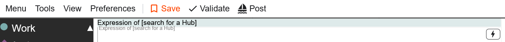
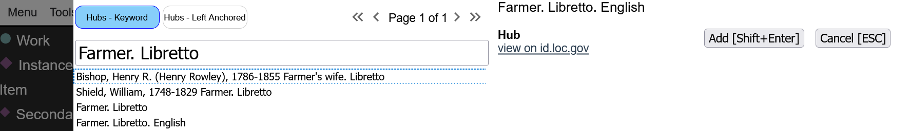
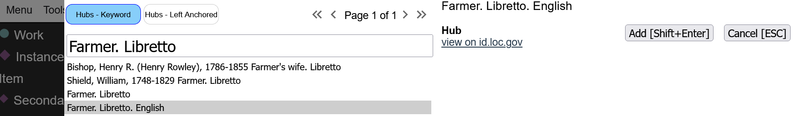
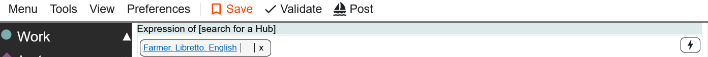
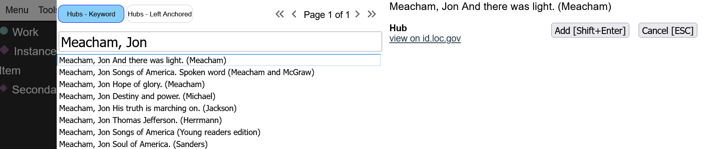

# Uniform Titles are Related Resources

The equivalent of adding Uniform Title in Bibframe is to create an 'expression of' relationship
to a Hub resource. More information about Hubs can be found [here](https://staff.loc.gov/wikis/display/BP2/Marva+cataloging+updates#Marvacatalogingupdates-Hubs).

The place to establish this relationship is at the top of the Work description in Marva.

This is a lookup.  Start typing to find the most relevant Hub. The Hub's label will be the common form of a Uniform Title MARC.

Select the Hub and "Add" it to the description.

You should see it near the top of the page.

If, in MARC, you would be entering a 240, use the name of the Primary Contributor when searching for a Hub.

